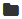

Creating a CCA Model
--------------------

Slycat™ accepts two file formats for table data, either Comma Separated Value (CSV) files, or Dakota tabular files (generated by 
Dakota [#]_, software which is frequently used to generate ensemble data sets).  If your data is not currently in one of these two 
formats, Excel can be used to create CSV files from most common table formats.  Note that if output metrics have been created 
separately in a post-processing step, they will need to be integrated with the inputs into a single file prior to model creation.  
In a CSV file, we expect to see only a single row of header information consisting of the column names.

.. figure:: Figure14.png
   :scale: 75
   :align: center
   
   **Figure 14: Popup dialog in the CCA model creation wizard.**

From your project page, click on the green *Create* button and select *New CCA Model* from the dropdown list.  A dialog for walking 
you through the process will then pop up, as shown in Figure 14.  The first page of the model creation wizard identifies whether 
the table is located on the local machine or whether the data is held on a remote machine.  Select *Local* or *Remote*, followed by 
*Continue* to advance to the next page of the wizard.

Local Files
===========

As shown in Figure 15, if you selected *Local*, the next page will display two fields, *File* and *Filetype*.  Adjacent to 
*File*, is the button *Browse*.  Clicking *Browse* brings up a local file browser, which you can use to navigate to the location 
of your data table.  After selecting a file, the file browser closes and the name of your selected file appears to the right of 
the *Browse* button, as shown in Figure 16.  Depending on the format of the selected file, select either *CSV* or 
*Dakota tabular* from the *Filetype* dropdown, followed by *Continue* to read the file.  Note, you can change your mind and read 
the table from a *Remote* host by clicking the *Back* button to return to the previous page.

.. figure:: Figure15.png
   :scale: 75
   :align: center
   
   **Figure 15: Local file upload dialog in CCA model creation wizard.**

.. figure:: Figure16.png
   :scale: 75
   :align: center
   
   **Figure 16: Selected file, table.csv, shown in CCA model creation dialog.**

Remote Files
============

As shown in Figure 17, if you select *Remote*, the *Choose Host* page enables you to log into a remote machine through Slycat™.  
First select a machine from the dropdown list, which is revealed by clicking the triangle to the right of *Hostname*.  If the 
machine you wish to access is not on the list, type the machine name into the field.  The name will be remembered and used as 
the default host for the next time.  *Username* defaults to the username that you provided when logging into Slycat™, but this 
field can be manually edited if desired.  Finally, enter your *Password* and click the *Continue* button in the lower right to 
connect to the remote host.

.. figure:: Figure17.png
   :scale: 75
   :align: center
   
   **Figure 17: Remote system login for table ingestion in CCA model creation wizard.**

Once you are connected, the model creation wizard will display a remote file browser.  If you have previously accessed this 
machine through Slycat™, the browser directory will be initialized to your last location.  Otherwise, the browser default 
directory will be the machine’s root directory.  There are two methods for navigating the remote directory structure to find 
your data: (1) if you know the full directory path, type it directly into the field at the top of the page (shown in Figure 18) 
and click the *Go* button;

.. figure:: Figure18.png
   :scale: 75
   :align: center
   
   **Figure 18: File path field in remote file browser.**

or (2) move up and down the directory hierarchy by clicking on folders in the list.  Clicking on |UpFolder| (the folder labeled 
‘..’ in the file list), or on the *Up Directory* button |UpDirectory| (to the right of the file path) moves you up a level in 
the hierarchy, while clicking on a named folder moves you down a level.  Once you are in the directory that contains your table 
data, click on the file to select it.  Ensure that the format shown in the *Filetype* dropdown matches the selected file’s type, 
then click *Continue* to read the file.  Note, you can change your mind and read the table from your *Local* host by clicking 
the *Back* button to return to the previous page.

.. |UpDirectory| image:: UpDirectory.png

Select Columns
==============
Once the table has been read, either from a *Local* or a *Remote* source, the *Select Columns* page displays a list of the 
table’s variable (column) names and asks you to categorize them as *Input*, *Output*, or *Neither* for the CCA analysis.  
Variables marked as *Neither* are omitted from the analysis altogether.  Since CCA requires numeric values, strings are 
automatically excluded from consideration.  

Looking at the variables in our *Cars* example in Figure 19,  the faded variable name at the top of the list, *Model*, is the 
name for each car model.  Because its values are all strings, it has been automatically set to *Neither* and cannot be changed.  
Although *Origin* is a numeric variable, the numbers are encoding categorical labels whose value order has no meaning 
(US = 1, Europe = 2, Asia =3).  Because the values have no ordinal interpretation, *Origin* should also be removed from the 
analysis.  

.. figure:: Figure19.png
   :scale: 75
   :align: center
   
   **Figure 19: Initial configuration in the** Select Columns **dialog for the cars data set.**
   
Since the number of inputs typically exceeds the number of outputs, we initialize all numeric variables to be inputs, leaving 
you to identify just the output and excluded variables.  If variables shown for this table don’t correspond to the ones you 
wanted or expected, you can click the *Back* button to select a different table file.

Variables can be marked one at a time by clicking the radio buttons, or they can be marked in larger groups by using either 
shift-click to select a contiguous group of variables, or by using control-click to pick a scattered set of rows (as 
demonstrated in Figure 20).   For group selections, you must click on the rows near the variable names instead of near the 
radio buttons.  Once you have highlighted a set of lines for joint assignment, click on the |AllOnIcon| icon under the desired 
category to set the radio buttons for the group, as shown in Figure 21.  Since CCA can be performed on any subset of variables, 
you can also use it to calculate correlations between multiple inputs and a single output, or between any two individual 
variables.  

.. figure:: Figure20.png
   :scale: 75
   :align: center
   
   **Figure 20: Click on the |AllOnIcon| icon beneath Output to label the highlighted variables as outputs.**

.. |AllOnIcon| image:: AllOnIcon.png

.. figure:: Figure21.png
   :scale: 75
   :align: center

   **Figure 21: Result of using shift-click and the group assignment icon to select** Output **variables.**
   
Sometimes value ranges between variables differ by many orders of magnitude, which can bias the analysis.   The checkbox, 
*Scale inputs to unit variance*, permits you to normalize the values prior to running CCA.  This feature is enabled by default.  
If you wish to perform the analysis using the original unscaled values, click within the box to remove the checkmark.

Once you have finished defining the input/output variables for the CCA analysis and have determined whether you want the 
values to be scaled, click *Continue* to go to the final step where you provide a name for your model.

Name Model
==========

.. rubric:: Footnotes

.. [#]	Adams, B.M., Ebeida, M.S., Eldred, M.S., Jakeman, J.D., Swiler, L.P., Bohnhoff, W.J., Dalbey, K.R., Eddy, J.P., Hu, K.T., Vigil, D.M., Bauman, L.E., and Hough, P.D., *Dakota, a Multilevel Parallel Object-Oriented Framework for Design Optimization, Parameter Estimation, Uncertainty Quantification, and Sensitivity Analysis: Version 5.3.1 User’s Manual.* Tech. Rep. SAND2010-2183, Sandia National Laboratories (2013).
