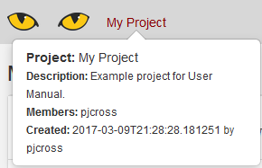

.. _Navbar:

Slycat™ Navbar
--------------
At the top of every Slycat™ page is the Navbar.  Working from left to right, we see the Slycat™ logo, a breadcrumb navigation path, and a set of colored buttons providing dropdown lists categorized by function.  Depending on the type of page currently being viewed, the buttons and the contents of the dropdowns will vary.  As shown in Figure 3, the Navbar for the main Projects page, the only button available is the green *Create* button for creating new projects.  Since the main Projects page lies outside and above any projects, the breadcrumb navigation path points to the current page, which is simply labeled as *Slycat*.  Figure 4 shows that for Navbars within a project or model page, there can be up to five buttons, including: *Create, Edit, Info, Bookmarks,* and *Delete*.  

.. image:: Figure3.png
**Figure 3: Slycat Navbar as seen on the main Projects page.  At this level, the Navbar displays the title Slycat because we have yet to move to an individual project page.**

.. image:: Figure4.png
**Figure 4: Navbar at the individual project page level.  Here the name of the project is ‘My Project’.  Note that the Bookmarks button is hidden until at least one bookmark has been created.**

As you move between pages at various levels, the breadcrumb path in the Navbar will change to reflect your current location.  The path has the format *Project Name / Model Name*.  The path can be used to navigate within the hierarchy.  Clicking on the *Project Name* will take you to that project’s page with its list of associated models.  Hovering over the *Project Name* will display the project description, the project members, the date of creation, and who created it (Figure 5).  Similarly, hovering over the *Model Name* will display the model description, the date of creation, and who created it.

**Figure 5: Hovering over the project name will display more detailed project information.**
