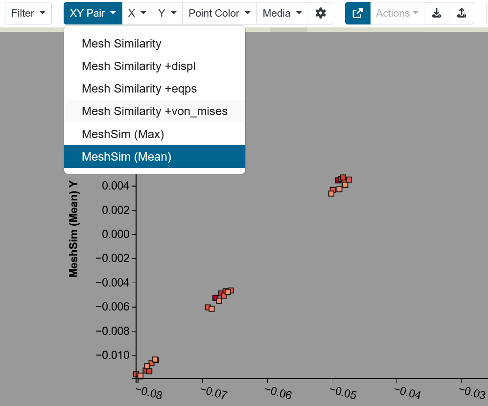

XY Pair Control
---------------

The Parameter Space model recognizes matched pairs of columns from the ingested data table, such as pairs of (x, y) coordinates.  When XY pairs are present Slycat allows a user to visualize that pair with a single selection in the Navbar, instead of individually selecting the X-axis variable and the Y-axis variable.

To mark the matched pair of columns in the initial data table, the labels for the 2 columns are prefaced with [XYpair X] and [XYpair Y].

Here is an examples of valid XY pair column label:

.. code-block:: bash

  [XYpair X]Risk PCA X, [XYpair Y]Risk PCA Y

The Source Data page contians the full specification for this feature, see the :ref:`csv-ref-label` page for these details and examples.

**XY Pair Plotting and Usage**

When XY Pairs are present, the Parameter Space user interface displays an **XY Pair** control for selecting a pair for scatterplot visualization.  The pair is correspondingly plotted on the X and Y axis, and the corresponding axis labels are displayed.

   
   **Figure 67:  XY Pair dropdown list showing the available pairs and the Y axis label of the selected pair.**
   
