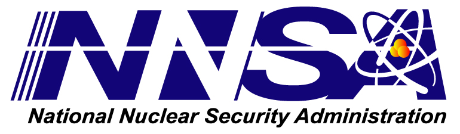

Acknowledgements
================

Sandia National Laboratories is a multi-mission laboratory managed and operated by National Technology and Engineering 
Solutions of Sandia, LLC, a wholly owned subsidiary of Honeywell International, Inc., for the U.S. Department of Energy’s 
National Nuclear Security Administration under contract DE-NA0003525.  This document is approved for release as 
SAND2020-6478 R.

