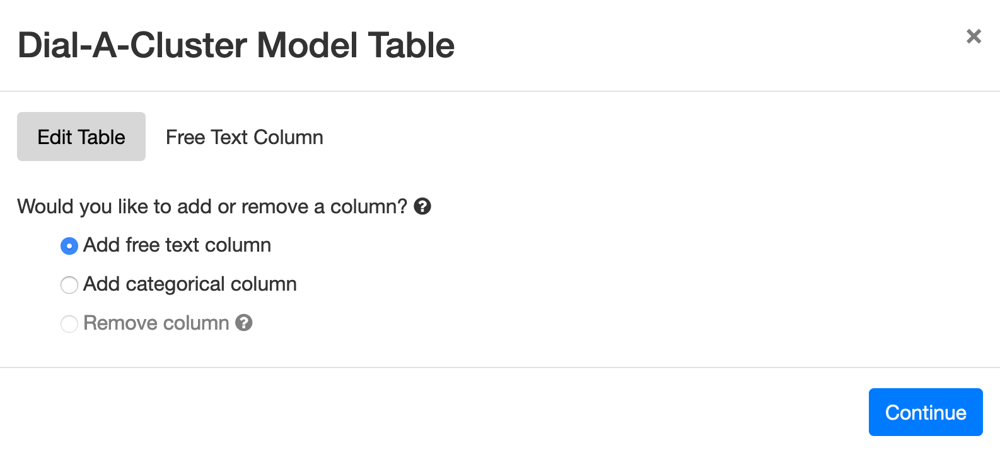
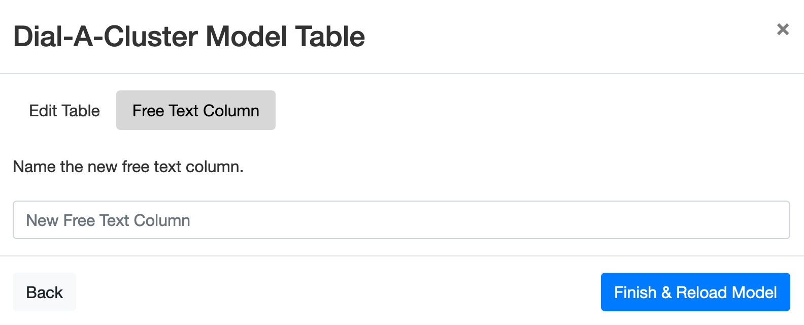
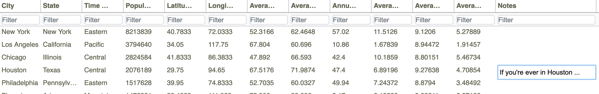
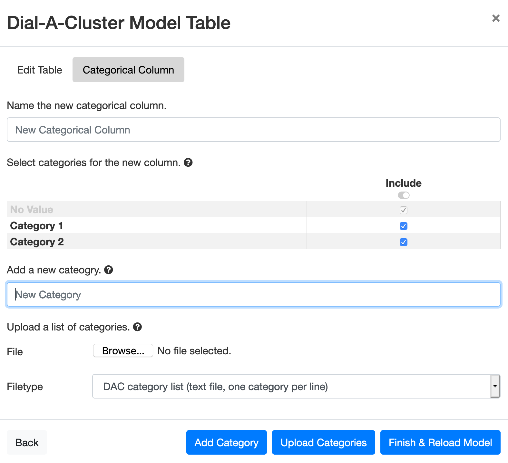
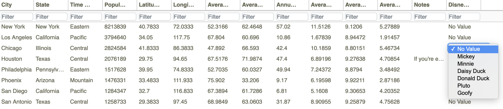

.. _AddingTableColumns:

Adding Table Columns
====================

Generally speaking, data cannot be changed once a model has been loaded.  However, columns can be added the 
*Metadata Table*, so that the user may enter notes or designate a given ensemble member as belonging to a specified 
category.  Columns are added using the yellow Edit > Model Table pulldown in the upper right of the Slycat™ screen, 
as shown in Figure 38.

.. figure:: figures/edit-pulldown-table.png
   :scale: 40 %
   :align: center

   **Figure 38: Edit pulldown menu with Model Table selected.**

After selecting Model Table from the Edit pulldown, a wizard appears to help you add columns to the 
*Metadata Table*, as shown in Figure 39.

   **Figure 39: Initial screen for the add column wizard in Dial-A-Cluster.**

DAC allows you to add two types of *Metadata Table* columns.  The first type of column is free text, which lets you 
type notes into the table describing a particular ensemble member.  To add a free text column, select “Add free text 
column” in the wizard and push the *Continue* button.  In this case you will see the next screen in the wizard, shown 
in Figure 40.

   **Figure 40: Add free text column wizard option.**

To add a free text column, simply type the name of the new column header into the wizard using the “New Free Text Column” 
text box and push *Finish & Reload Model*.  After the model has been reloaded, a new column will appear in the 
*Metadata Table* to the far right, as shown in Figure 41.  To add notes to a row in the new column click on that row 
and type the notes.  Once you press enter or otherwise finish the entry, it will be saved with the model as part of the table.

   **Figure 41: Entering free text into the Metadata Table.**

The second type of column available in the add column wizard is a categorical column.  A categorical column lets you define 
a set of categories for a particular ensemble member.  Once added, the user can label the *Metadata Table* row using only 
those categories.  To add a categorical column, select “Add categorical column” in the dialog from Figure 39 and press 
*Continue*.  You will see the dialog in Figure 42.

   **Figure 42: Wizard used to add a categorical column to the Metadata Table.**

First, type the column name into the “New Categorical Column” text box.  Next, add categories to your column.  The categories 
can be added either manually by entering each category into the “New Category” text box and pushing the *Add Category* button, 
or by uploading from a file.  In Figure 42, two categories have been added manually, named “Category 1” and “Category 2”.  These 
categories are shown in a list in the middle of the dialog.  The “No Value” category is a required member of any category list.

To upload a list of categories, select a file using the “Browse …” button.  The file should be a text file containing one 
category per line.  Once a file has been selected, press the *Upload Categories* button.  The categories from the file will 
be displayed in the list in Figure 42, where “Category 1” and “Category 2” are shown.

Once all the desired categories have been entered, you can make a final selection using the check boxes in the list in Figure 
42.  If you have entered too many categories by mistake or uploaded categories that you don’t need these can now be unselected.  
Press the *Finish & Reload Model* button to add the new categorical column to the *Metadata Table*.

   **Figure 43: Selecting a category for a row of the Metadata Table.**

After the model has been reloaded, a new column will appear in the *Metadata Table* to the far right, as shown in Figure 43.  To 
mark a row in the new column with a given category, click on that row and select the category.  Once you press enter or 
otherwise finish the entry, it will be saved with the model as part of the table.

