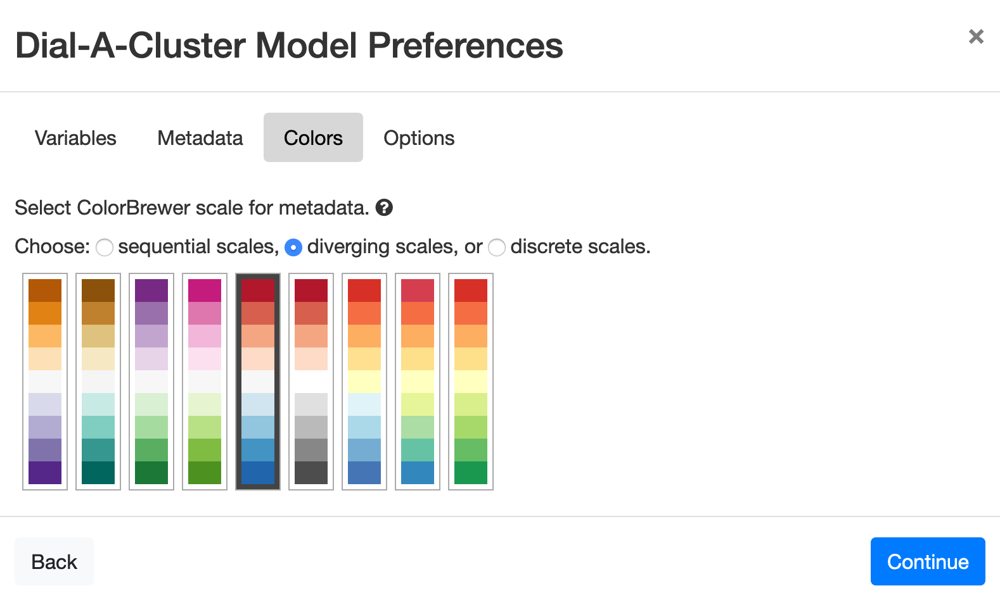
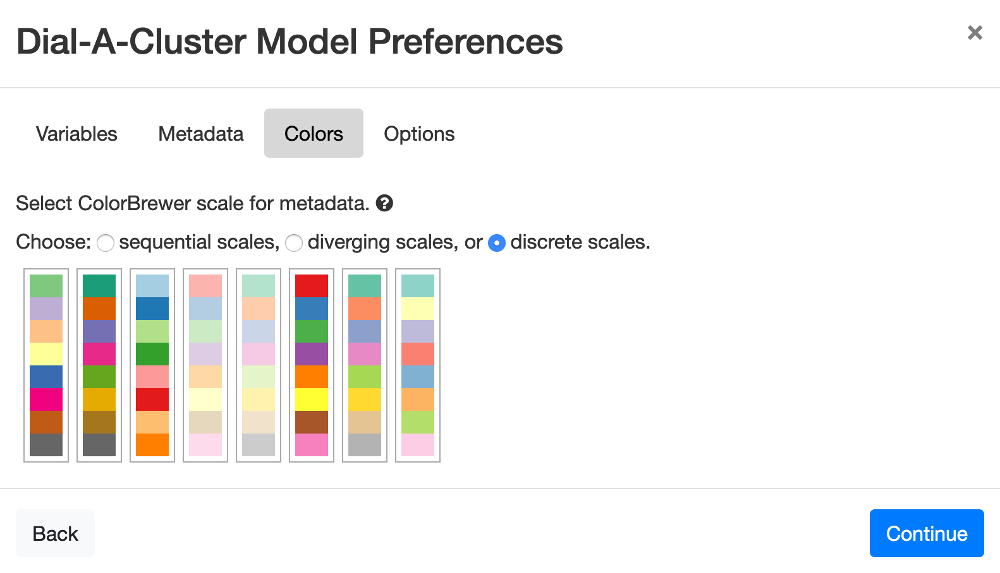

Color Palettes
==============

.. |RadioButton| image:: icons/radio-button.png
   :scale: 40 %

.. |RadioButtonSelected| image:: icons/radio-button-selected.png
   :scale: 40 %

The default color scheme for shading points using table columns is gray scale.  This color scheme can be overridden 
using the color palette selection dialog, shown in Figure 52.  The color selection dialog has three available palette 
types for use: sequential, diverging, and discrete.  These different palette styles can be selected using the radio 
buttons under “Choose: |RadioButtonSelected| sequential scales, |RadioButton| diverging scales, or |RadioButton|
discrete scales.”  The diverging scales are shown in Figure 53.  The discrete scales are shown in Figure 54.  In 
each case, click on a scale to make a selection.  In Figure 53, the red-to-blue scale has been selected.  Press the 
*Continue* button to advance to the final dialog.

.. figure:: figures/color-sequential.png
   :scale: 40 %
   :align: center

   **Figure 52: The color selection dialog, showing the sequential palettes.**

   **Figure 53: The diverging color scales, with red-to-blue selected.**

   **Figure 54: The discrete color scales.**
