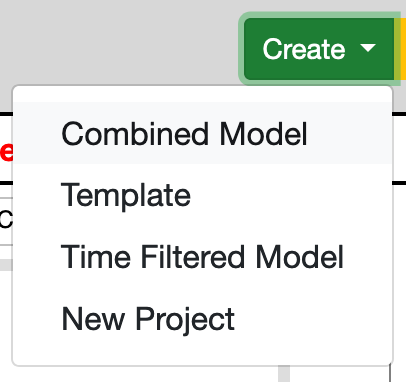
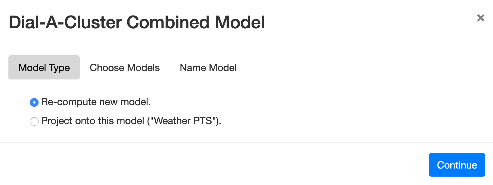
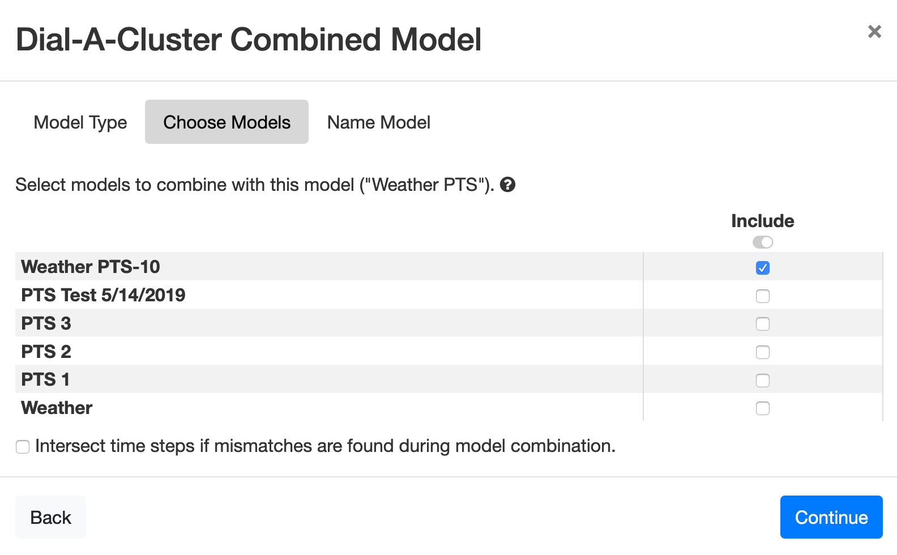

Combining Models
================

Two or more existing models can be combined to create a new larger model.  From an existing model, select Create > Combined Model 
from the green *Create* pulldown in the upper right of Slycat™ user interface.  This pulldown option is shown in Figure 44.  Note 
that this must be done from within an existing model.  The pulldown menu options will be different at the project level.

   **Figure 44: Combining multiple existing models to create a new model.**

Selecting Create > Combined Model will open a wizard for creating a combined model, as shown in Figure 45.  The first step in 
creating a combined model is choosing whether the *Scatterplot* coordinates will be re-computed from scratch or the combined 
model data will be projected onto the current model (the model used to launch the combined model wizard).  To re-compute the 
*Scatterplot* coordinates using all model data equally, select “Re-compute new model” and press *Continue*.  To use the current 
model as a basis for the *Scatterplot* coordinates, select “Project onto this model” and press *Continue*.

   **Figure 45: Initial dialog for creating a combined model.**

The next dialog in the combined model wizard is shown in Figure 46.  In this dialog, the user is presented with a list of 
available models in the current project.  Compatible models may be selected from the list and used to create the new combined 
model.  Compatible models must have identical *Metadata Table* headers and equal number of time series.  If the user has checked 
the box next to “Intersect time points if mismatches are found during model computation,” compatible models may have different 
number of time points for a given time series.  Otherwise they must also have identical time points for each time series.  If you 
select an incompatible model, the wizard will prompt you and continue only when all selected models are verified to be compatible.

   **Figure 46: Selecting models to use for creating a combined model.**

Once compatible models have been selected, push the Continue button to advance the wizard.  The final dialog allows you to name 
and mark the model the combined model, in the same way that new models are named (see Figure 11).  After naming the model, an 
indicator and accompanying message window will be presented to show progress and any problems making the combined model 
(see Figure 13).
