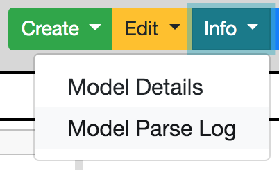
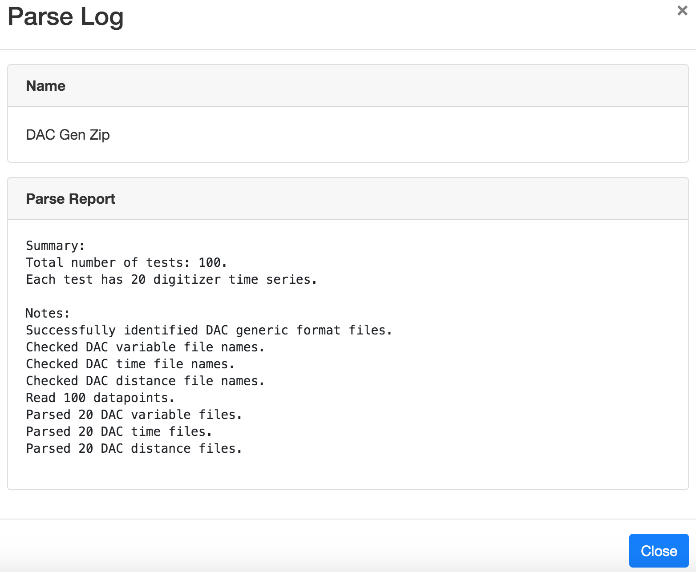

Model Parse Log
===============

Once a model has been created, information on the success of the model import process can be viewed using the *Info* 
button menu pulldown, as shown in Figure 15.

   **Figure 15: Accessing the Model Parse Log from the Info button pulldown.**

The model parse log itself is just the complete record of the import process and any problems that may have been encountered 
during import.  This information is displayed in the progress box as the model loaded (Figure 13).  The parse log gives you 
information about which files in your ensemble were not imported, what data might have been modified, and why.  The log for 
the Weather data is shown in Figure 16.

   **Figure 16: Model Parse Log for DAC Generic Zip Format containing the Weather data.**
