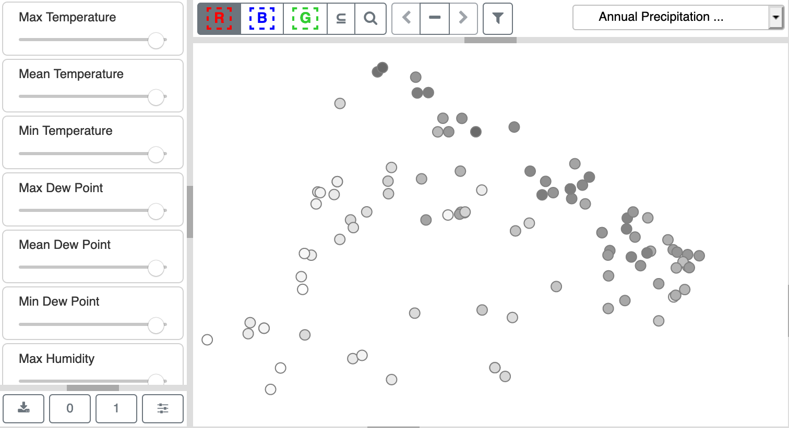
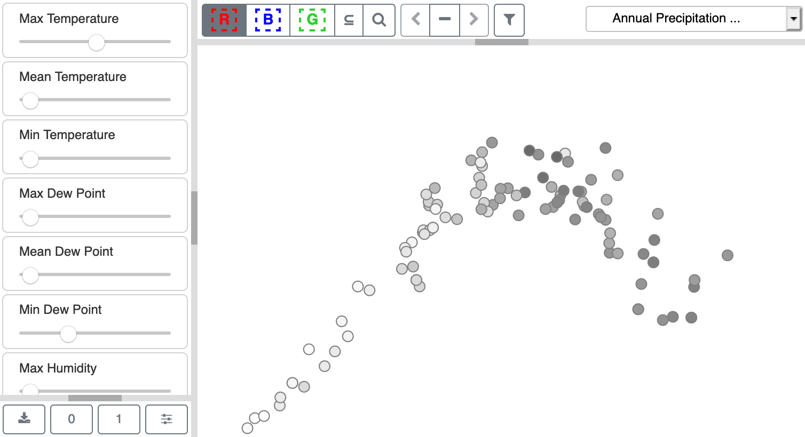

Optimize Slider Weights |Optimize|
==================================

.. figure:: figures/color-by-pulldown-context.png
   :scale: 60 %
   :align: center

   **Figure 20: Weather data scalar variables for color-coding Scatterplot points.  The default is 'Do Not Color'.**

To provide some sense of what this function does, here is an example of the results for optimizing the point projection and 
slider values against the *Annual Precipitation* variable.  Figure 21 shows the *Scatterplot* where all temporal variables are 
You may want to explore the relationships between temporal variables and one of the scalar variables in a column of the 
*Metadata Table*.  First, select a *Metadata Table* column header for the comparison from the dropdown list shown in Figure 20.  
This dropdown is above the *Scatterplot* in the upper right.  Then click the |Optimize| icon, which will adjust the slider weights 
to generate a *Scatterplot* projection maximizing differences in the value range of the selected variable.  The resulting slider 
weights indicate the relative importance of each temporal variable in the phenomenon described by the set of values in that 
*Metadata Table* column.  Note that *Metadata Table* columns with string values can be selected here, but that those strings are 
changed to integers starting from 1, where each integer corresponds to a string value in the column, ordered alphabetically.

   **Figure 21: Slider weights (all set to one) and point positions before optimizing for Annual Precipitation.**

To provide some sense of what this function does, here is an example of the results for optimizing the point projection and 
slider values against the *Annual Precipitation* variable.  Figure 21 shows the *Scatterplot* where all temporal variables are 
fully weighted with their slider values set to 1.  The points are colored by their values for *Annual Precipitation*, where 
high values are dark gray and low values are white.

   **Figure 22: Slider weights and point positions after optimizing for Annual Precipitation.**

Figure 22 shows the adjusted slider values and point projections after the optimization.  From the sliders that are visible in 
the figure, we can see that many temporal variables do not contribute to *Annual Precipitation* (i.e. their sliders are set to 
zero), while others display varying levels of influence.  *Mean Humidity* (not shown) exerts the strongest influence, with its 
slider value set to one.  *Max Temperature* and *Min Dew Point* also exert influence.
