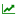

.. _PlotResolutionIndicators:

Plot Resolution Indicators |NumPlotsGoodIcon| |ResolutionGoodIcon| 
==================================================================

.. |ResolutionBadIcon| image:: icons/plot-resolution-bad.png
   :scale: 80 %

.. |NumPlotsBadIcon| image:: icons/number-plots-bad.png
   :scale: 80 %

.. figure:: figures/rgb-plots-pulldown.png
   :align: center

   **Figure 31: Dropdown temporal variable selection in Time Series Plot.**

As shown in Figure 31, there are two green icons to the left of the variable name pulldown.  These icons provide information about the 
resolution of the rendering in the plot.  The |NumPlotsGoodIcon2| indicates that every selected point has been drawn as a line in the plot.  
Once the selected points exceed the *maximum number of plots*, the |NumPlotsGoodIcon2| icon changes to |NumPlotsBadIcon|, signaling that not 
all lines are being drawn.  The |ResolutionGoodIcon2| indicates that each line is being drawn at full resolution.  If the sampling in the 
time series data exceeds the *maximum plot resolution*, the icon changes to |ResolutionBadIcon|, alerting you that lines are not being drawn 
using the full number of samples.

The threshold values for both the *maximum number of plots* and the *maximum plot resolution* are user adjustable through 
:ref:`ModelPreferences`.  The default values for these variables are 33 and 500, respectively.

