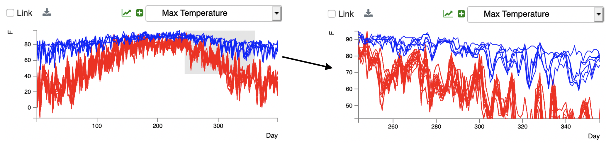

Plot Zooming
============

Initially, plots are drawn to display the full range of values over both axes.  However, subregions can be shown via zooming by rubber-banding 
within the plot.  A user is shown performing a zoom operation in Figure 32.

   **Figure 32: Zooming in a time series plot.  The user zooms by rubber-banding to get the grey box on the left.  After the box is complete (the mouse button is released), the plot is magnified, as seen on the right.**
