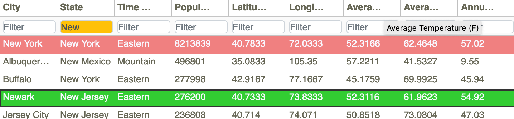

.. _TableFiltering:

Table Filtering
===============

The rows in the *Metadata Table* can be filtered using the filter boxes below each column header, as shown in 
Figure 37.

   **Figure 37: Filtering the Metadata Table entries using the filter boxes below the column headers.**

By default, the table filters use case insensitive substring search of the column entries to filter the rows of 
the table.  However, regular expressions can also be used to filter the table.  Some examples of regular expression 
searches are:

•	^3152 – find all serial numbers starting with 3152.
•	^3152-00(125) – find serial numbers 3152-001, 3152-002, or 3152-005.
•	(Eastern|Pacific) – find cities in Eastern or Pacific time zones.

When a filter is inactive, the filter box is colored white.  When a filter is active, the filter box will be colored 
yellow.  If a filter is an incorrect regular expression, the filter will be colored red.  In this case the filter is 
active but using case insensitive substring search.  (Typically, this will cause the entire table to be filtered away.)  
Once the regular expression has been corrected, the filter will go back to yellow.

The table filters work in real time, so that the table is filtered as you type.  Once you have filtered the table to obtain 
only the rows that you desire, the *Scatterplot* and *Time Series Plots* can also be filtered by pushing the filter plots 
button (see :ref:`FilterPlots`) above the *Scatterplot*.  The points in the *Scatterplot* will then be restricted to 
display only those ensemble members in the filtered version of the table.  In addition, the plots in the *Time Series Plots* 
will also be restricted to those shown in the table.  

.. |YellowFilterIcon| image:: icons/filter-plots-on.png
   :scale: 40 %

After pushing the filter plots button, it will be turned yellow |YellowFilterIcon| to indicate that you are viewing a restricted set of the data.  Any colored selections not in the filtered table will also be hidden, although the selections are not forgotten.  Pushing the filter plots button again will restore the points and plots, and the selections will be unaffected.

