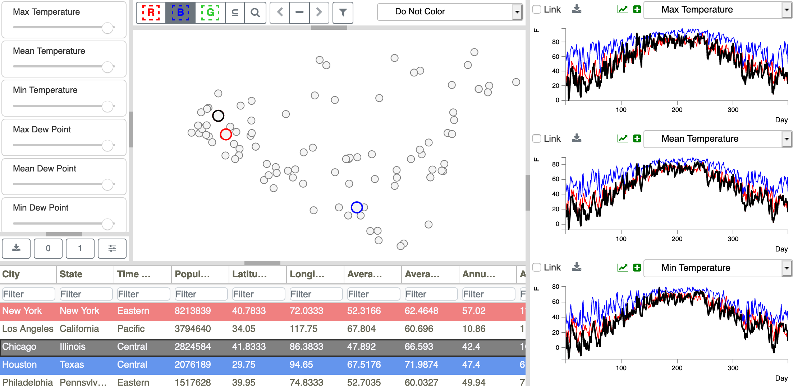

.. _TableFocusSelection:

Table Focus Selection
=====================

The *Metadata Table* allows a focus selection, similar to the focus selection available for the *Scatterplot* 
(:ref:`PointFocusSelection`) and the *Time Series Plots* (:ref:`PlotFocusSelection`).  To bring an ensemble member into 
focus selection, simply click on the row of interest in the *Metadata Table*.  If that row is a member of one 
of the colored selections, it will be highlighted in black with a black outline, the corresponding point in the 
*Scatterplot* will be highlighted in black, and the corresponding plot in the *Time Series Plot* will be drawn 
in black.  If that row is not a member of one of the colored selections, the row will not be highlighted in 
black, but will still be shown using a black outline.  Any table rows not in the current subset (see 
:ref:`SubsetAnalysis`) will not be available for focus selection.  A focus selection is shown in Figure 36.

   **Figure 36: Focus selections are shown in black in the Metadata Table.  Corresponding points in the Scatterplot and corresponding plots in the Time Series Plots are also shown in black.**
