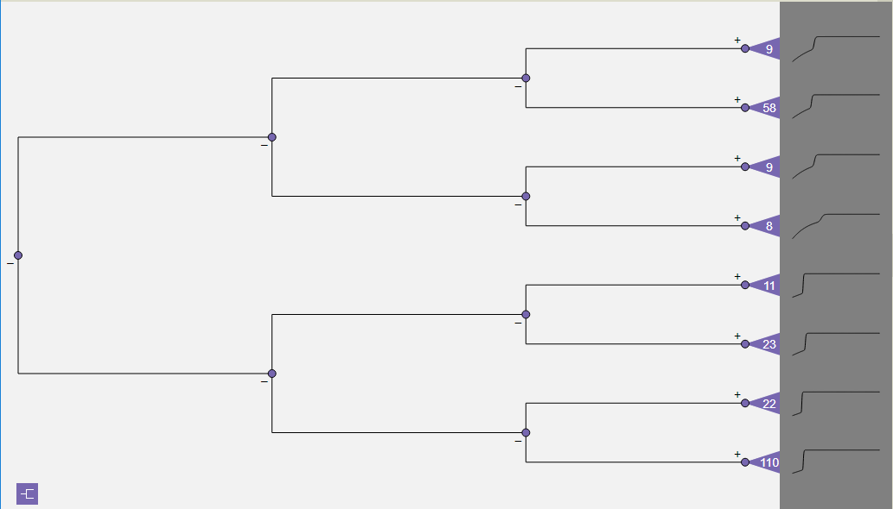

Dendrogram View
===============

The *Dendrogram View* displays a tree that clusters line plots from a single temporal variable by similarity.  The analysis 
begins by calculating distances between each pair of time series vectors, an O(n\ :sup:`2`) calculation.  Then the distance 
matrix is used to build the dendrogram using agglomerative clustering.  Each time series output variable generates a different 
tree.  

   
   **Figure 56: Dendrogram tree level compression.**

The dendrogram is drawn with the root on the left and the leaves on the right.  To reduce visual clutter, the tree is not drawn 
at full resolution at every level down to the leaves.  Instead, only the first four levels of the tree are initially rendered 
(as shown in Figure 56), with the last level on the right consisting of collapsed subtrees for the remaining sections of the 
tree down to the leaves.  The subtrees are represented by purple triangular icons, each labeled with the number of nodes in 
its subtree.  Non-collapsed nodes in the tree are drawn as purple dots.  

.. toctree::
  :maxdepth: 3
  
  DendrogramControl.rst
  DendrogramFiltering.rst
  Sparklines.rst
