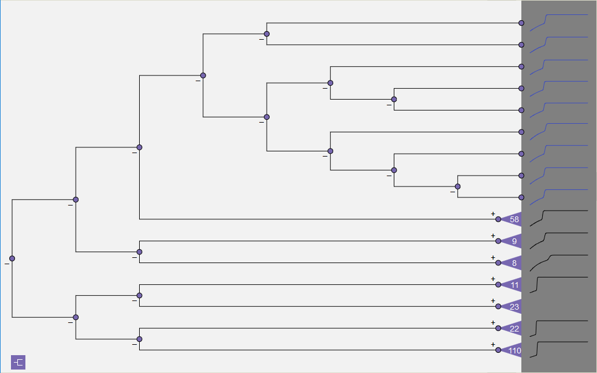

Dendrogram Expansion/Contraction
--------------------------------

The expansion or contraction of each node is individually controlled through the ‘+’ or ‘-‘ icons that appear to the left of 
each node, respectively above or below the line connecting the node to its parent.  In Figure 57, the subtree with 58 nodes 
in Figure 56 has been expanded by clicking the ‘+’.  Each expansion adds two levels of the tree to the dendrogram.  Note that
leaf-level nodes are drawn as dots.

.. figure:: Figure57.png
   :scale: 100
   :align: center
   
   **Figure 57: Expansion of second subtree from the top (previously shown as the subtree with 58 nodes in Figure 56).  Each expansion adds two additional levels.**
   
To expand a subtree all the way down to the leaves in a single action, click on the subtree triangle itself.   In Figure 58, 
the subtree with 9 nodes at the top of the dendrogram in Figure 56 has been expanded to the leaf level with this one-click 
operation.  Caution should be exercised when doing a full subtree expansion for subtrees over 20 or so nodes, since the 
dendrogram can become cluttered and largely unintelligible.   Figure 59 demonstrates the results of clicking on the subtree 
with 110 nodes at the bottom of the dendrogram in Figure 56.

   
   **Figure 58: Subtree with 9 nodes expanded to leaf level by clicking triangular subtree icon.**

.. figure:: Figure59.png
   :scale: 100
   :align: center
   
   **Figure 59: One-click expansion of subtree with 110 nodes.**
   
The operation of collapsing nodes reduces all of the nodes below the designated node (the node whose ‘-‘ icon is clicked) 
into a single subtree, regardless of the number of levels that are currently visible.  In Figure 60, the bottom half of 
the dendrogram in Figure 57 has been collapsed into a single subtree with 166 nodes.  This ability to expand and contract 
sections of the dendrogram controls the level of detail, maximizing the rendered portion of the tree around areas of 
interest.

.. figure:: Figure60.png
   :scale: 100
   :align: center
   
   **Figure 60: Collapsed subtree that combines the 4 subtrees from the lower half of the dendrogram in Figure 57.**
