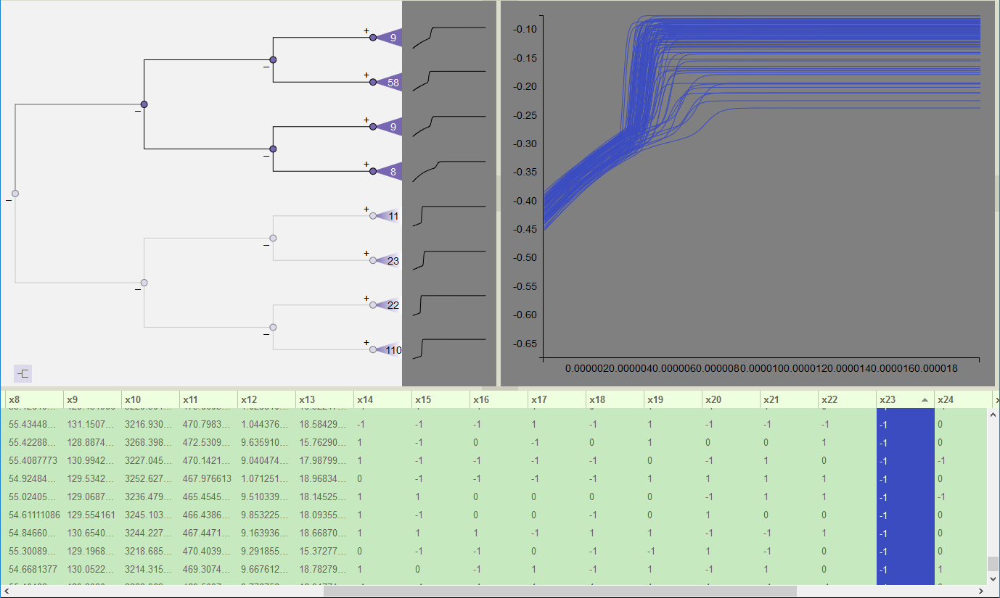

Dendrogram Visibility Filtering
-------------------------------

The dendrogram also acts as a visibility filter to select which lines are shown in the Simulation View and which rows appear 
in the Variable Table.  Click on the purple dot representing any node (or the dot at the tip of a subtree triangle) to 
restrict visibility to the leaf nodes associated with that subset of the tree.  Non-visible nodes are grayed out.  Figure 61 
and Figure 62 show the results of limiting visibility to the subtrees of the upper and lower halves of the dendrogram, 
respectively.  These examples clearly demonstrate that the upper and lower subtrees are grouping the results generated by 
input differences in the variable *x23* into two categories.  Inputs of -1 (color-coded blue) start higher on the y-axis and 
escalate slowly over a longer time period before peaking, while 0 and 1 (white and red, respectively) start lower on the 
y-axis and peak more rapidly.  These two groups have distinctly different characteristics, which the analysis has captured.

   
   **Figure 61: Visibility is limited to nodes in top half of dendrogram by clicking the upper second-level node.  Table order is sorted by the values of variable x23 (not in dendrogram leaf order, shown by lavender graph icon in dendrogram lower left).**
   
.. figure:: Figure62.png
   :scale: 100
   :align: center
   
   **Figure 62: Visibility is limited to nodes in bottom half of dendrogram by clicking the lower second-level node.  Table order is in default dendrogram leaf order (shown by purple graph icon in lower left of dendrogram).**
   
.. figure:: Figure63.png
   :scale: 100
   :align: center
   
   **Figure 63: Complex visibility selection made through a combination of dendrogram expansion and using control-click to add nodes to the visible set.  Paths from the root to the visible nodes are darkened, while the other paths are grayed out.**
   
As shown in Figure 63, more complex visibility selections can be constructed through a combination of dendrogram expansion 
operations and using control-click to add individual nodes to the visible set.  Control-click functions as a toggle, so it 
flips the visibility state for any node with each click.  The paths from the root to all visible nodes are darkly drawn, while 
the remaining paths, though still visible, are grayed out.  
