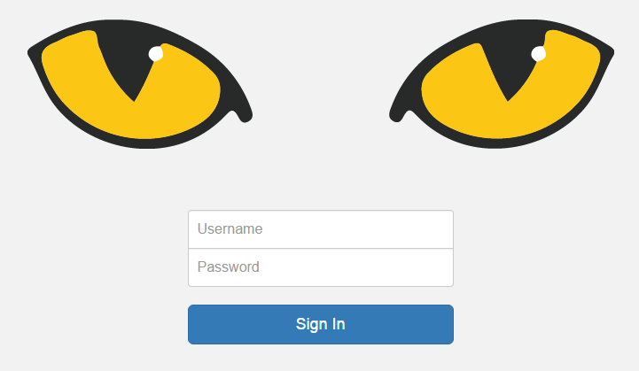

.. _GettingStarted:

Getting Started
---------------
Slycat™ is typically accessed through a web browser. Firefox, Chrome, and Safari are supported browsers. MicroSoft Edge appears to support Slycat™ visualization features but is not tested.

Since multiple Slycat™ servers exist, you will need to find the URL for the environment or network you're on and paste it into your browser's address field. If your institution uses single sign-on, login will happen automatically and you will find yourself on the main Projects page. If the authentication mechanism for your institution relies on username and password, you will be taken to the Slycat™ login page shown in Figure 2.

   
   **Figure 2: Slycat password-authentication login page.**

Slycat™ pages exist at one of three levels: the main Projects page, an individual project page, and an individual model page.  
The main Projects page displays all projects which you are authorized to access.  This list of projects is unique to you.  
Clicking on a project name will take you to that project page, which will contain a list of all models that have been generated 
within the project.  Clicking on a model name will take you to that model page, which will display a visualization of its data.  
At any level, clicking on the Slycat™ logo will return you to the main *Projects* page.  

The first time that you access the Slycat™ website, your projects list will probably be empty, unless someone else has already 
created a project and added you as a project member.  Since models cannot exist outside of a project, you must first create a 
project (see :ref:`project-creation`) before you can create a model.  Project-specific information consists of the project name, 
a list of project members, a set of models, and a set of saved bookmarks for models within that project.
