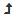

Remote Files
============

As shown in Figure 17, if you select *Remote*, the *Choose Host* page enables you to log into a remote machine through Slycat™.  
First select a machine from the dropdown list, which is revealed by clicking the triangle to the right of *Hostname*.  If the 
machine you wish to access is not on the list, type the machine name into the field.  The name will be remembered and used as 
the default host for the next time.  *Username* defaults to the username that you provided when logging into Slycat™, but this 
field can be manually edited if desired.  Finally, enter your *Password* and click the *Continue* button in the lower right to 
connect to the remote host.

.. figure:: Figure17.png
   :scale: 75
   :align: center
   
   **Figure 17: Remote system login for table ingestion in CCA model creation wizard.**

Once you are connected, the model creation wizard will display a remote file browser.  If you have previously accessed this 
machine through Slycat™, the browser directory will be initialized to your last location.  Otherwise, the browser default 
directory will be the machine’s root directory.  There are two methods for navigating the remote directory structure to find 
your data: (1) if you know the full directory path, type it directly into the field at the top of the page (shown in Figure 18) 
and click the *Go* button;

.. figure:: Figure18.png
   :scale: 75
   :align: center
   
   **Figure 18: File path field in remote file browser.**

or (2) move up and down the directory hierarchy by clicking on folders in the list.  Clicking on |UpFolder| (the folder labeled 
‘..’ in the file list), or on the *Up Directory* button |UpDirectory| (to the right of the file path) moves you up a level in 
the hierarchy, while clicking on a named folder moves you down a level.  Once you are in the directory that contains your table 
data, click on the file to select it.  Ensure that the format shown in the *Filetype* dropdown matches the selected file’s type, 
then click *Continue* to read the file.  Note, you can change your mind and read the table from your *Local* host by clicking 
the *Back* button to return to the previous page.

.. |UpFolder| image:: UpFolder.png
