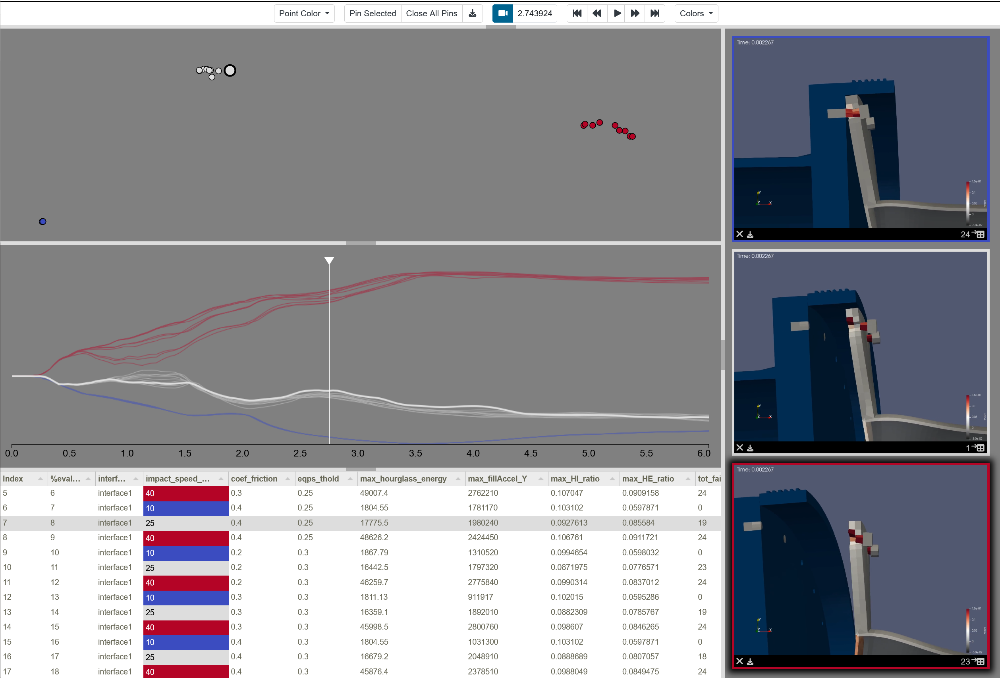
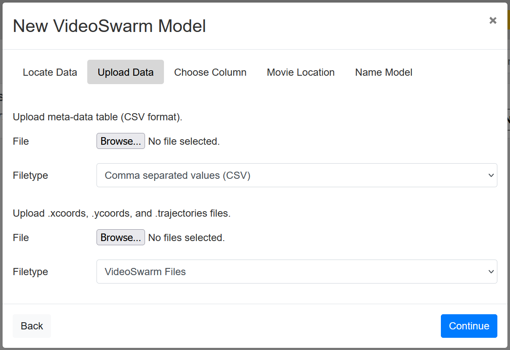

.. _vs-ref-label:

VideoSwarm Model
================

Often it is useful to produce videos rendered from multiple viewpoints when generating an ensemble of numerical simulations.  Videos are commonly used to understand simulation results and have the added advantage of being generic for any type of simulation.  Videos have a smaller storage requirement than full simulation results, and may contain more information than summary statistics or location-based samples.

Given a set of simulation videos, several questions arise: How can we compare and contrast videos in our ensemble?  Where in time are the videos similar and where do they diverge?  Do the videos cluster?  Can we identify interesting behavior in the videos and when it occurs?  In other words, without actually watching every video, how can we digest the full content of the data?  To answer these questions, we have developed a Slycat model for analyzing simulation video ensembles, called VideoSwarm.

   **Figure 1: VideoSwarm model example.  SAND2026-17305O.**

Data Format
^^^^^^^^^^^

The VideoSwarm format consists of four files, which can be provided by the user, generated on the Slycat server, or produced using the :ref:`slypi-ref-label`.  The four files are:

* Meta-Data Table, e.g. `movies.csv`: This is a standard Slycat style .csv file containing meta data and (importantly) URL links to the movies to be shown in the resulting VideoSwarm model.  See :ref:`csv-ref-label`.
* .xcoords File, e.g. `movies.xcoords`: These are the x-coordinates per time step of the VideoSwarm dimension reduction for each movie, listed as a comma separted matrix per row by time step.
* .ycoords File, e.g. `movies.ycoords`: These are the y-coordinates per time step of the VideoSwarm dimension reduction for each movie, listed as a comma separted matrix per row by time step.
* .trajectories Files, e.g. `movies.trajectories`: These are the trajectory traces shown in the VideoSwarm model below the scatter plot of the dimension reduction, listed as a comma separated matrix per row by video.

A VideoSwarm example dataset can be found in the slycat-data repository at: https://github.com/sandialabs/slycat-data/tree/master/vs/spinodal/vs-local.

These files are the same files requested by the VS creation wizard if you choose `Create` -> `New VideoSwarm Model` -> `Local (pre-computed VideoSwarm format)` from a Slycat project page.

   **Figure 2: Files expected from the VideoSwarm creation wizard.  The `movies.csv` file would be input to the "Upload meta-data table" field and the `movies.xcoords`, `movies.ycoords`, and `movies.trajectories` files would be input to the "Upload .xcoords, .ycoords, and .trajectories files" field.**

Reference
^^^^^^^^^

Shawn Martin, Milosz A Sielicki, Jaxon Gittinger, Matthew Letter, Warren L Hunt, Patricia J Crossno, "VideoSwarm: Analyzing Video Ensembles"  in Proc. IS&T Int’l. Symp. on Electronic Imaging: Visualization and Data Analysis,  2019,  pp 685-1 - 685-12,  https://doi.org/10.2352/ISSN.2470-1173.2019.1.VDA-685