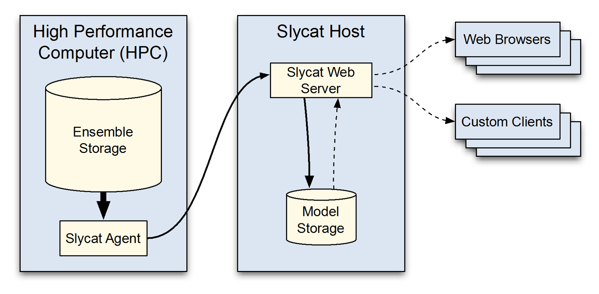

.. _Overview:

Overview
========
Slycat™ is a web-based system for performing data analysis and visualization of potentially large quantities of remote, 
high-dimensional data.  Slycat™ specializes in working with ensemble data.  An ensemble is a group of related data sets, which 
typically consists of a set of simulation runs exploring the same problem space.  An ensemble can be thought of as a set of samples 
within a multi-variate domain, where each sample is a vector whose value defines a point in high-dimensional space.  To understand 
and describe the underlying problem being modeled in the simulations, ensemble analysis looks for shared behaviors and common 
features across the group of runs.  Additionally, ensemble analysis tries to quantify differences found in any members that deviate 
from the rest of the group. 

The Slycat™ system integrates data management, scalable analysis, and visualization.  Results are viewed remotely on a user’s 
desktop via commodity web clients using a multi-tiered hierarchy of computation and data storage, as shown in Figure 1.  Our goal 
is to operate on data as close to the source as possible, thereby reducing time and storage costs associated with data movement.  
Consequently, we are working to develop parallel analysis capabilities that operate on High Performance Computing (HPC) platforms, 
to explore approaches for reducing data size, and to implement strategies for staging computation across the Slycat™ hierarchy. 

   
   **Figure 1: Slycat multi-tiered hierarchy, designed for large data analysis and exploration with minimal data movement.**

Within Slycat™, data and visual analysis are organized around projects, which are shared by a project team.  Project members are 
explicitly added, each with a designated set of permissions. Although users sign-in to access Slycat™, individual accounts are not 
maintained.  Instead, authentication is used to determine project access.  Within projects, Slycat™ models capture analysis results 
and enable data exploration through various visual representations.  Although for scientists each simulation run is a model of 
real-world phenomena given certain conditions, we use the term model to refer to our modeling of the ensemble data, not the 
physics.  Different model types often provide complementary perspectives on data features when analyzing the same data set.  Each 
model visualizes data at several levels of abstraction, allowing the user to range from viewing the ensemble holistically to 
accessing numeric parameter values for a single run.  Bookmarks provide a mechanism for sharing results, enabling interesting model 
states to be labeled and saved.

.. toctree::
  :maxdepth: 3
  
  GettingStarted.rst
  Navbar.rst
  Projects.rst
  Models.rst
  Bookmarks.rst
  Templates.rst
